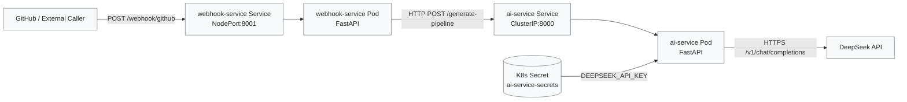

# DMD Cloud (Azure + Minikube Version)

## Objective

This project receives GitHub webhook events, forwards the relevant code diff to an AI service, and returns AI-generated CI/CD pipeline output.

This project automatically turns code change notifications into ready-to-run CI/CD pipeline suggestions using an AI assistant.

When your code repository sends a webhook about a change, the webhook service forwards the change to the AI service, which analyzes the diff and returns a proposed GitHub Actions pipeline. This makes it faster and easier for teams to generate or update CI workflows without writing them from scratch.

## What Each Component Does

- `webhook_service` (FastAPI, port 8001)
  - Exposes `POST /webhook/github`
  - Calls the AI service using `AI_SERVICE_URL` (default: `http://ai-service:8000`)
  - Config: `AI_SERVICE_TIMEOUT_SECONDS` (default: `75.0` seconds)
- `ai_service` (FastAPI, port 8000)
  - Exposes `GET /health` and `POST /generate-pipeline`
  - Calls DeepSeek API using `DEEPSEEK_API_KEY` from Kubernetes Secret
  - Config: `DEEPSEEK_TIMEOUT_SECONDS` (default: `60.0` seconds)
- `k8s/`
  - Deployments and Services for both apps
  - `webhook-service` is externally reachable (`NodePort`)
  - `ai-service` is internal-only (`ClusterIP`)
- `terraform/`
  - Provisions Azure Resource Group + AKS cluster
- `orchestrator/`
  - Simple health endpoint (`/health`) placeholder service

## Architecture Diagram (Mermaid)



## Local Dev (Minikube)

1. Start Minikube:
   ```bash
   minikube start
   ```

2. Build images in Minikube Docker environment:
   ```bash
   minikube image build -t ai-service:latest ./ai_service
   minikube image build -t webhook-service:latest ./webhook_service
   ```

3. Create secret (do not commit real keys):
   ```bash
   kubectl apply -f k8s/ai-service-secret.template.yaml
   ```

4. Deploy workloads:
   ```bash
   kubectl apply -f k8s/
   ```

5. Open the webhook service:
   ```bash
   minikube service webhook-service
   ```

## Azure Deployment

1. Install Terraform and Azure CLI
2. Authenticate:
   ```bash
   az login
   ```
3. Provision AKS:
   ```bash
   cd terraform
   terraform init
   terraform apply
   ```

## Notes

- Keep `ai-service` as `ClusterIP` when only internal service-to-service traffic is needed.
- Change `Service` type to `LoadBalancer` or use Ingress if you need controlled external access.
- **Timeout Configuration**: DeepSeek API responses can take 40-60 seconds. The defaults are:
  - `AI_SERVICE_TIMEOUT_SECONDS=75` (webhook waiting for AI service)
  - `DEEPSEEK_TIMEOUT_SECONDS=60` (AI service waiting for DeepSeek API)
  - Adjust these if you experience timeout errors or if the external API is slower/faster.
- Use `test-webhook.json` for local testing with curl or Postman.
- test
        - GitHub push
           ↓
        Webhook receives
           ↓
        Returns 200 immediately
           ↓
        Calls AI async
           ↓
        AI generates pipeline